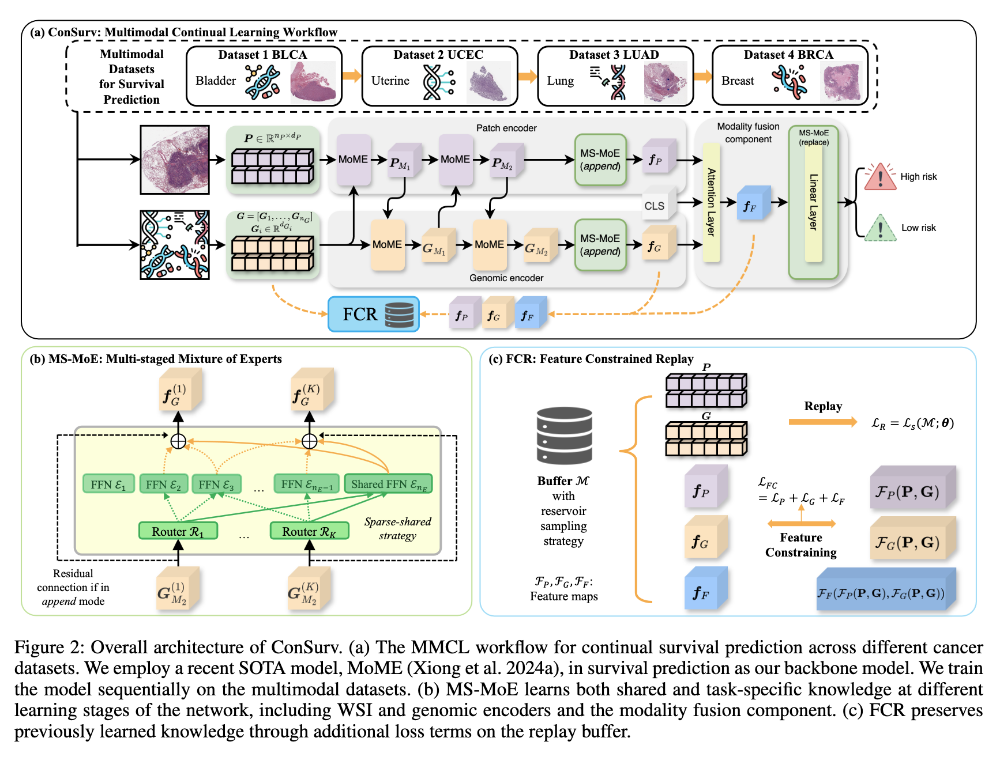

# ConSurv: Multimodal Continual Learning for Survival Analysis (AAAI 2026)

Dianzhi Yu, Conghao Xiong, Yankai Chen, Wenqian Cui, Xinni Zhang, Yifei Zhang, Hao Chen, Joseph J.Y. Sung, Irwin King

[🚀 [AAAI Proceedings](https://ojs.aaai.org/index.php/AAAI/article/view/40013)] | [📖 [arXiv Paper](https://arxiv.org/abs/2511.09853)]

<p align="center">
  
</p>

**Abstract:** Survival prediction of cancers is crucial for clinical practice, as it informs mortality risks and influences treatment plans. However, a static model trained on a single dataset fails to adapt to the dynamically evolving clinical environment and continuous data streams, limiting its practical utility. While continual learning (CL) offers a solution to learn dynamically from new datasets, existing CL methods primarily focus on unimodal inputs and suffer from severe catastrophic forgetting in survival prediction. In real-world scenarios, multimodal inputs often provide comprehensive and complementary information, such as whole slide images and genomics; and neglecting inter-modal correlations negatively impacts the performance. To address the two challenges of catastrophic forgetting and complex inter-modal interactions between gigapixel whole slide images and genomics, we propose ConSurv, the first multimodal continual learning (MMCL) method for survival analysis. ConSurv incorporates two key components: Multi-staged Mixture of Experts (MS-MoE) and Feature Constrained Replay (FCR). MS-MoE captures both task-shared and task-specific knowledge at different learning stages of the network, including two modality encoders and the modality fusion component, learning inter-modal relationships. FCR further enhances learned knowledge and mitigates forgetting by restricting feature deviation of previous data at different levels, including encoder-level features of two modalities and the fusion-level representations. Additionally, we introduce a new benchmark integrating four datasets, Multimodal Survival Analysis Incremental Learning (MSAIL), for comprehensive evaluation in the CL setting. Extensive experiments demonstrate that ConSurv outperforms competing methods across multiple metrics.

## Tested Environment

- OS: Ubuntu 22.04.5 LTS
- GPU: NVIDIA A100 80GB

## Installation

### Option 1: Conda (Recommended)

Create the environment from the provided `environment.yml`:

```bash
conda env create -f environment.yml
conda activate consurv
```

This creates a conda environment named `consurv` with all required dependencies (Python 3.12, PyTorch, scikit-survival, etc.).

### Option 2: Pip

If you prefer to install manually:

```bash
conda create -n consurv python=3.12
conda activate consurv
pip install torch torchvision
pip install scikit-survival lifelines wandb h5py pandas
```

For a complete list of dependencies, refer to [environment.yml](environment.yml).

## Usage

### Training ConSurv

```bash
CUDA_VISIBLE_DEVICES=0 python3 main_wsi.py \
    --wandb_entity=<your-wandb-entity> \
    --wandb_project=<your-wandb-project> \
    --fold=0 \
    --model=consurv \
    --model_config=default \
    --buffer_size=32 \
    --n_epochs=20
```

### Training Baselines

Replace `--model=consurv` with other methods:

```bash
# DER (Dark Experience Replay)
CUDA_VISIBLE_DEVICES=0 python3 main_wsi.py \
    --wandb_entity=<your-wandb-entity> \
    --wandb_project=<your-wandb-project> \
    --fold=0 \
    --model=der \
    --model_config=default \
    --buffer_size=32 \
    --n_epochs=20

# Other supported models: sgd, ewc_on, lwf, er, derpp, lora4cl, mose_wsi, imex_reg
```

For 5-fold evaluation, change `--fold=0` to `--fold=1`, `--fold=2`, `--fold=3`, and `--fold=4`.

For more experiment configurations, see [run_experiments.md](run_experiments.md).

## Data Preprocessing

For WSI feature extraction, please refer to [MoME](https://github.com/BearCleverProud/MoME). The training splits and genomic data are from [MCAT](https://github.com/mahmoodlab/MCAT). To save space in this repository, please download the following folders from MCAT and place them in the repository's root directory:

- `dataset_csv/`, `datasets_csv_sig/` — Genomic CSV data
- `splits/` — 5-fold cross-validation split files

The padded genomic data (`dataset_csv_padding/`) is already included in this repository. We apply zero-padding to align the genomic feature dimensions across different cancer types.

Place the processed WSI features under your data directory, then update the `data_root_dir` field in  `datasets/configs/seq-survival/*.yaml` to point to your data path:

```yaml
data_root_dir: '/path/to/your/pt_data'
```

## Acknowledgement

This repository is built upon [MoME](https://github.com/BearCleverProud/MoME), [Mammoth](https://github.com/aimagelab/mammoth), and [ConSlide](https://github.com/HKU-MedAI/ConSlide). Thanks again for their great works!

## Reference

We hope this work and repository are useful for your research. If they help your work or if you use parts of this code, we would greatly appreciate it if you could cite our [paper](https://ojs.aaai.org/index.php/AAAI/article/view/40013):

```bibtex
@article{yu2026consurv,
  title={ConSurv: Multimodal Continual Learning for Survival Analysis},
  author={Yu, Dianzhi and Xiong, Conghao and Chen, Yankai and Cui, Wenqian and Zhang, Xinni and Zhang, Yifei and Chen, Hao and Sung, Joseph J. Y. and King, Irwin},
  volume={40},
  url={https://ojs.aaai.org/index.php/AAAI/article/view/40013},
  DOI={10.1609/aaai.v40i33.40013},
  number={33},
  journal={Proceedings of the AAAI Conference on Artificial Intelligence},
  year={2026},
  month={Mar.},
  pages={27899-27907}
}
```
